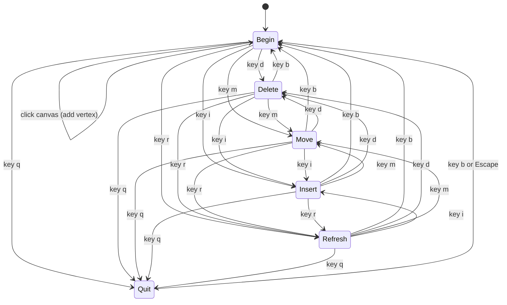

# PolyLine Editor (Next.js + Tailwind)

Single-page PolyLine Editor for lab work, built with keyboard-first interaction and brutalist UI styling.

## Phase Assignment and Responsibility

- **Phase assignment:** Implementation phase (with integrated Requirements, Analysis, and Design notes)
- **Individual responsibility:** Full-stack implementation of interaction engine, rendering, undo/redo history, persistence, responsive UI, accessibility, and deployment-ready setup

## Stack

- Next.js 15 (App Router)
- React 19
- Tailwind CSS
- HTML5 Canvas for high-frequency rendering
- Lucide icon set

## Core Keyboard Actions

- `b` (begin): Start/continue a polyline
- `d` (delete): Delete closest vertex and reconnect neighboring segments
- `m` (move): Drag closest vertex
- `r` (refresh): Redraw mode (forces visual refresh state)
- `q` (quit): Pause editor interactions

Extension key:

- `i` (insert): Insert point on nearest segment

## Data Model

Array-based structure (`polys[]`) is used for all geometry and edits:

```ts
export type Polyline = {
  id: string;
  vertices: { x: number; y: number; z: number }[];
};
```

Why this fits the lab:

- Direct indexing gives fast nearest-vertex lookup and mutation
- Easy undo/redo snapshots with deep cloning
- Supports up to 100 polylines cleanly

## HCI Principles Applied

### Fitts's Law

- Large chunky controls (`min-h-12`, thick borders)
- Frequently used controls clustered at top and aligned with canvas
- Canvas vertices highlighted when cursor approaches snap distance

### Hick's Law

- 5 required actions are primary and always visible
- Extra actions (insert/undo/redo/save/load) are grouped but secondary
- Strong visual hierarchy: action strip → canvas → status/details

### Cognitive Load Management

- Persistent mode card (`Current Mode`)
- Live nearest-vertex feedback and visual highlights
- Preview line during Begin mode
- Status panel reports mode context, polyline count, vertex count, history

## Required Extensions Implemented

1. File save/load
- Save JSON snapshot to file
- Load from JSON file input
- Autosave in `localStorage` and restore on startup

2. Point insertion
- Insert mode (`i`) adds vertex on nearest segment projection

3. Undo/redo
- Snapshot-based command history
- Buttons + `Ctrl/Cmd+Z` and `Ctrl/Cmd+Y`

4. 3D polyline editing
- Each vertex stores `z`
- Z-depth via slider and `Alt + ArrowUp/ArrowDown`
- Rendering projects `y` using z offset to simulate depth

## State Transition Notation (STN)



## Brutalist Design Decisions

- High-contrast blocks with thick borders and offset shadows
- Bold uppercase typographic treatment
- Hard-edged geometry and strong visual grouping
- Snappy transitions (`150-200ms`) with reduced-motion support

## Accessibility

- Keyboard shortcuts for all primary actions
- Large click targets (44px+)
- Icon buttons include `aria-label`
- Focus-visible ring states on controls
- Reduced-motion media query support
- Contrast-aware theme system (light/dark)

## Challenges and How They Were Solved

1. **Challenge:** High-frequency canvas interactions while preserving React state clarity  
   **Solution:** Keep geometry in structured array state and redraw canvas in one pass per frame-triggering update.

2. **Challenge:** Undo/redo across drag and continuous depth edits  
   **Solution:** Snapshot history before mutation sessions, then commit live updates to geometry.

3. **Challenge:** 3D extension without full 3D engine complexity  
   **Solution:** Store `z` per vertex and project to screen with deterministic `toScreenY(y, z)` transform.

## Run Locally

```bash
npm install
npm run dev
```

Open: `http://localhost:3000`

## Build for Production

```bash
npm run build
npm run start
```

## Deployment

Deploy to Vercel (recommended):

1. Push repo to GitHub
2. Import project in Vercel
3. Build command: `npm run build`
4. Output: default Next.js settings

## Additional Improvements Beyond Base Scope

- Theme toggle for light/dark brutalist palettes
- Grid background for better spatial orientation while editing
- Mode-safe quit overlay to prevent accidental edits
- Live status dashboard for interaction transparency
